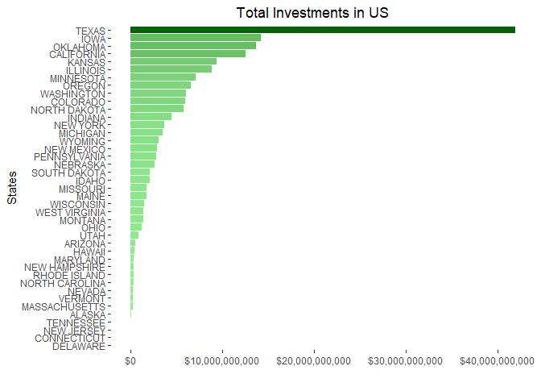
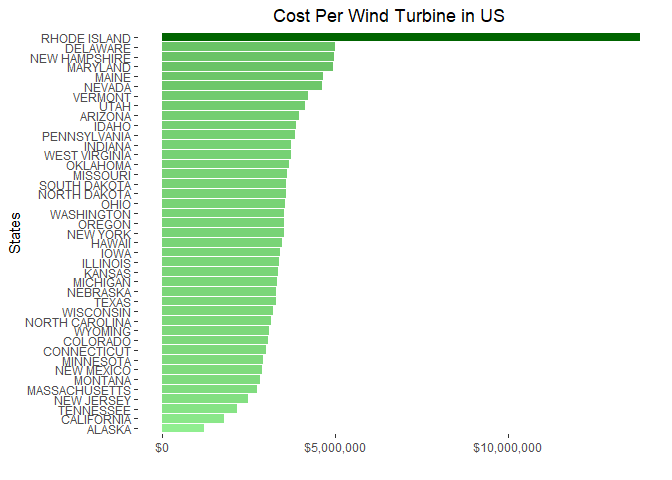
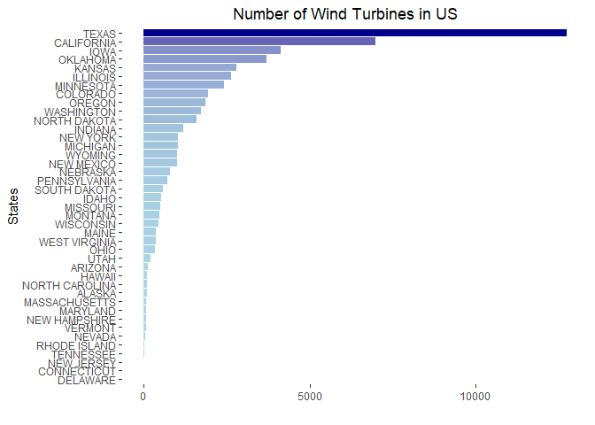
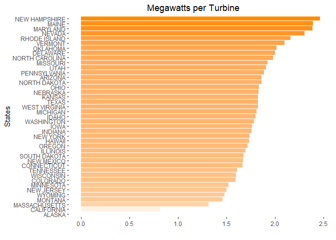

A Brief Look at Wind Energy in the United States
================================================

Purpose:
--------

The primary purpose of this document is to reinforce the data cleaning and exploration phases within the data science methodology using R. The secondary purpose is to generate questions in regards to the domain of the data; for example... 'why do some states do not have any wind energy?' or 'Is there a meaningful relationship between amount of projects and amount of turbines? If so, why or why not?'. These questions will later be explored and hopefully answered.

Ideally, the findings on this report would also be used in an R Shiny dashboard similar to one used in actual production after going through the first two purposes.

### Process:

First, we load the necessary package called 'tidyverse' that allows use to use additional data manipulation or data visualization functions found in other packages.

``` r
library(tidyverse)
```

    ## -- Attaching packages --------------------------------------------------------------------------------- tidyverse 1.2.1 --

    ## v ggplot2 3.1.0     v purrr   0.3.0
    ## v tibble  2.0.1     v dplyr   0.7.8
    ## v tidyr   0.8.2     v stringr 1.3.1
    ## v readr   1.3.1     v forcats 0.3.0

    ## -- Conflicts ------------------------------------------------------------------------------------ tidyverse_conflicts() --
    ## x dplyr::filter() masks stats::filter()
    ## x dplyr::lag()    masks stats::lag()

Next, we can begin loading the data and taking a brief look at it as a whole.

``` r
dfraw <- read.csv("E:/Documents/R/Data/projects/data/USWind.csv",
               header = TRUE,
               na.strings = "",
               stringsAsFactors = FALSE)


glimpse(dfraw)
```

    ## Observations: 50
    ## Variables: 7
    ## $ Ranking                     <chr> "1", "2", "3", "4", "5", "6", "7",...
    ## $ State                       <chr> "TEXAS", "OKLAHOMA", "IOWA", "CALI...
    ## $ Installed_Capacity_.MW.     <chr> "23,262", "7,495", "7,312", "5,686...
    ## $ Equivalent_Homes_Powered    <chr> "6,235,000", "2,268,000", "1,935,0...
    ## $ Total.Investment_.Millions. <chr> "42,000", "13,700", "14,200", "12,...
    ## $ Wind_Projects_Online        <int> 136, 45, 107, 104, 35, 49, 98, 31,...
    ## $ Wind_Turbines               <chr> "12,750", "3,717", "4,145", "6,972...

``` r
summary(dfraw)
```

    ##    Ranking             State           Installed_Capacity_.MW.
    ##  Length:50          Length:50          Length:50              
    ##  Class :character   Class :character   Class :character       
    ##  Mode  :character   Mode  :character   Mode  :character       
    ##                                                               
    ##                                                               
    ##                                                               
    ##  Equivalent_Homes_Powered Total.Investment_.Millions. Wind_Projects_Online
    ##  Length:50                Length:50                   Min.   :  0.00      
    ##  Class :character         Class :character            1st Qu.:  2.00      
    ##  Mode  :character         Mode  :character            Median : 15.00      
    ##                                                       Mean   : 21.78      
    ##                                                       3rd Qu.: 25.75      
    ##                                                       Max.   :136.00      
    ##  Wind_Turbines     
    ##  Length:50         
    ##  Class :character  
    ##  Mode  :character  
    ##                    
    ##                    
    ## 

``` r
colnames(dfraw)
```

    ## [1] "Ranking"                     "State"                      
    ## [3] "Installed_Capacity_.MW."     "Equivalent_Homes_Powered"   
    ## [5] "Total.Investment_.Millions." "Wind_Projects_Online"       
    ## [7] "Wind_Turbines"

At this point, I decided to break down the steps even further in regards to how I want to approach this set. \#\#\# Things to Do \#\#\#\#\# Clean: rename columns (done in Excel), remove commas / periods in numbers, change variable type \#\#\#\#\# Explore: Descriptive Statistics, Mutate new algebraeic columns (grouped by dollars)

Now that some first steps have been defined, we can go ahead and start. However, The following code is showcasing my initial approach without any edits along with my actual comments I made as I worked through. I will have a condensed chunk of code that will summarize this portion of the analysis after going through the initial approach.

``` r
#- removing commas in one column
#- The below code would remove the commas in one column
# dfraw$Installed_Capacity_.MW. <- as.numeric(gsub(",","",dfraw$Installed_Capacity_.MW.))

#- However, we want to remove all the commas in the dataframe.
#- Instead of writing down the same code for each column, we can use a function.
#- create a funcion called "commaclean" to remove commas

commaclean <- function(x){
  as.numeric( gsub("\\,","", x))
   }

#- if you try the function on one column, it returns NAs introduced by coercion.
commaclean(dfraw$Total.Investment_.Millions.)

#- Have to change the NA's to 0. 
#- The below code does not work because the character type is not numeric.
#- dfraw[is.na(dfraw)] <- 0
#- Therefore, we assign the 0 as a character "0" 

dfraw[is.character(dfraw) | dfraw=="NA"] <- "0"
dfraw

#- If we apply the function to the dataframe, it will remove the values in the State column.
#- Therefore we can separate the State column for now and drop it using the subset() function.

states <- dfraw$State
df = subset(dfraw, select = -State)

#- Now we can apply our commaclean function to the dataframe.

df[] <- sapply(df, commaclean)

#- Finally, we insert the States column back using the add_column function from the tibble package (found in tidyverse)

df <- add_column(df, State = states, .after = "Ranking")
```

#### Condensed Code 1

Now that my initial approach has been worked through and explained, below is the summary and output of the previous code.

``` r
dfraw <- read.csv("E:/Documents/R/Data/projects/data/USWind.csv",
                  header = TRUE,
                  na.strings = "",
                  stringsAsFactors = FALSE)

commaclean <- function(x){
  as.numeric( gsub("\\,","", x))
}
dfraw[is.character(dfraw) | dfraw=="NA"] <- "0"
states <- dfraw$State
df = subset(dfraw, select = -State)
df[] <- sapply(df, commaclean)
df <- add_column(df, State = states, .after = "Ranking")
df
```

    ##    Ranking          State Installed_Capacity_.MW. Equivalent_Homes_Powered
    ## 1        1          TEXAS                   23262                  6235000
    ## 2        2       OKLAHOMA                    7495                  2268000
    ## 3        3           IOWA                    7312                  1935000
    ## 4        4     CALIFORNIA                    5686                  1298000
    ## 5        5         KANSAS                    5110                  1719000
    ## 6        6       ILLINOIS                    4464                  1050000
    ## 7        7      MINNESOTA                    3699                  1012000
    ## 8        8         OREGON                    3213                   604600
    ## 9        9       COLORADO                    3106                   889100
    ## 10      10     WASHINGTON                    3075                   695300
    ## 11      11   NORTH DAKOTA                    2996                  1021000
    ## 12      12        INDIANA                    2117                   440700
    ## 13      13       MICHIGAN                    1904                   471700
    ## 14      14       NEW YORK                    1829                   366500
    ## 15      15     NEW MEXICO                    1682                   422100
    ## 16      16        WYOMING                    1489                   408700
    ## 17      17       NEBRASKA                    1445                   486700
    ## 18      18   PENNSYLVANIA                    1369                   314000
    ## 19      19   SOUTH DAKOTA                     977                   293100
    ## 20      20          IDAHO                     973                   228000
    ## 21      21       MISSOURI                     959                   181100
    ## 22      22          MAINE                     923                   206500
    ## 23      23      WISCONSIN                     746                   142100
    ## 24      24        MONTANA                     720                   199800
    ## 25      25  WEST VIRGINIA                     686                   149300
    ## 26      26           OHIO                     617                   145300
    ## 27      27           UTAH                     391                    86900
    ## 28      28        ARIZONA                     268                    54600
    ## 29      29 NORTH CAROLINA                     208                    43800
    ## 30      30         HAWAII                     206                    59800
    ## 31      31       MARYLAND                     191                    47500
    ## 32      32  NEW HAMPSHIRE                     185                    38500
    ## 33      33         NEVADA                     152                    33600
    ## 34      34        VERMONT                     149                    25900
    ## 35      35  MASSACHUSETTS                     113                    20500
    ## 36      36         ALASKA                      62                    15200
    ## 37      37   RHODE ISLAND                      54                    14200
    ## 38      38      TENNESSEE                      29                     2800
    ## 39      39     NEW JERSEY                       9                     1900
    ## 40      40    CONNECTICUT                       5                     1300
    ## 41      41       DELAWARE                       2                        0
    ## 42       0        ALABAMA                       0                        0
    ## 43       0       ARKANSAS                       0                        0
    ## 44       0        FLORIDA                       0                        0
    ## 45       0        GEORGIA                       0                        0
    ## 46       0       KENTUCKY                       0                        0
    ## 47       0      LOUISIANA                       0                        0
    ## 48       0    MISSISSIPPI                       0                        0
    ## 49       0 SOUTH CAROLINA                       0                        0
    ## 50       0       VIRGINIA                       0                        0
    ##    Total.Investment_.Millions. Wind_Projects_Online Wind_Turbines
    ## 1                        42000                  136         12750
    ## 2                        13700                   45          3717
    ## 3                        14200                  107          4145
    ## 4                        12600                  104          6972
    ## 5                         9400                   35          2795
    ## 6                         8900                   49          2632
    ## 7                         7100                   98          2428
    ## 8                         6600                   31          1868
    ## 9                         6000                   25          1949
    ## 10                        6100                   20          1725
    ## 11                        5800                   28          1611
    ## 12                        4500                   16          1203
    ## 13                        3500                   26          1051
    ## 14                        3700                   27          1052
    ## 15                        2900                   17          1005
    ## 16                        3100                   22          1005
    ## 17                        2600                   22           789
    ## 18                        2800                   24           726
    ## 19                        2100                   14           583
    ## 20                        2100                   15           541
    ## 21                        1800                    8           499
    ## 22                        1800                   18           386
    ## 23                        1500                   18           466
    ## 24                        1400                   16           493
    ## 25                        1400                    6           376
    ## 26                        1200                   37           336
    ## 27                         851                    5           205
    ## 28                         573                    5           144
    ## 29                         330                    1           105
    ## 30                         412                    7           119
    ## 31                         397                    6            80
    ## 32                         374                    5            75
    ## 33                         306                    1            66
    ## 34                         300                    9            71
    ## 35                         236                   44            86
    ## 36                         126                   19           104
    ## 37                         346                   15            25
    ## 38                          39                    2            18
    ## 39                          15                    2             6
    ## 40                           9                    2             3
    ## 41                           5                    1             1
    ## 42                           0                    0             0
    ## 43                           0                    1             0
    ## 44                           0                    0             0
    ## 45                           0                    0             0
    ## 46                           0                    0             0
    ## 47                           0                    0             0
    ## 48                           0                    0             0
    ## 49                           0                    0             0
    ## 50                           0                    0             0

The following code and comments also detail my next step. Again, there will be a condensed portion after summarizing it all nicely.

``` r
#- Data Calculations (Exploration)
#- I am interested in examining the Megawatt per Turbine as well as the Cost per Turbine.
#- We create additional columns using the mutate() function in the dplyr package.
#- The output comes back in scientific not while converting the total investment in millions to raw costs.
#- Therefore we use the format() function to output the actual cost of the new "total_investment" column.
#- This turns the dataframe variables from <dbl> to <I(chr)> which actually causes complications for now.
#- We will fix it in the next section; I just wanted to showcase how format() can be used to quickly check.
#- We also use the select() function to assign which columns to appear first, then line the rest up with everything().

dfe <- select(format(mutate(df,
       total_investment = df$Total.Investment_.Millions.*1000000,
       cost_per_turbine = total_investment / df$Wind_Turbines,
       capacity_per_turbine_.MW. = df$Installed_Capacity_.MW. /df$Wind_Turbines), scientific=F),
       State, total_investment, Wind_Turbines, cost_per_turbine, Installed_Capacity_.MW., capacity_per_turbine_.MW., everything())
glimpse(dfe)

#- Cleaning Again
#- There is no need to have two total investment columns and the rankings column is not useful.
#- Therefore, I decided to drop them from the dataframe.

drops <- c("Total.Investment_.Millions.", "Ranking")
dfe <- dfe[, !(names(dfe) %in% drops)]

#- Remember how the format() function changed our variable types?
#- We can fix it here, but this all could be avoided. For examples sake, the following is how I fixed it:
#- First, I created a duplicate dataframe. Then I removed the state column.
#- Next, I use the mutate_all() function to apply a function(xx) which turns characters into numerics.
#- if you use the format() function, it will then turn everything back into characters which is what we want to avoid.

dfetest <- dfe
dfetest = subset(dfetest, select = -State)
dfetest <- mutate_all(dfetest, function(xx) as.numeric(as.character(xx)))
# dfetest <- format(dfetest, scientific=F)
glimpse(dfetest)

#- We can see that our dfetest dataframe is now properly numeric, however back in scientific notation.
#- To fix this, we can just change the how R handles numbers using the options(scipen=x) function.
#- Setting scipen to 999 removes all scientific notation.
#- Setting scipen to 0 uses scientific notation.

options(scipen=999)
# options(scipen=0)

#- Now we can add back in our states column.

dfe <- add_column(dfetest, State = states, .before = "total_investment")
glimpse(dfe)

#- next is to create a new dataframe containing states without investments in wind energy.
#- then removing those states from the dfe datframe. This will be done in the condensed section next.
```

#### Condensed Code 2\]

Below summarizes the above into a block of code without the format() function.

``` r
options(scipen=999)

dfe <- select(mutate(df,
                            total_investment = df$Total.Investment_.Millions.*1000000,
                            cost_per_turbine = total_investment / df$Wind_Turbines,
                            capacity_per_turbine_.MW. = df$Installed_Capacity_.MW. /df$Wind_Turbines),
              State, total_investment, Wind_Turbines, cost_per_turbine, Installed_Capacity_.MW., capacity_per_turbine_.MW., everything())
drops <- c("Total.Investment_.Millions.", "Ranking")
dfe <- dfe[, !(names(dfe) %in% drops)]
dfe$State <- as.factor(dfe$State)
dfmissing <- filter(dfe, total_investment == 0)
dfe <-dfe[!(dfe$total_investment ==0),]

glimpse(dfmissing)
```

    ## Observations: 9
    ## Variables: 8
    ## $ State                     <fct> ALABAMA, ARKANSAS, FLORIDA, GEORGIA,...
    ## $ total_investment          <dbl> 0, 0, 0, 0, 0, 0, 0, 0, 0
    ## $ Wind_Turbines             <dbl> 0, 0, 0, 0, 0, 0, 0, 0, 0
    ## $ cost_per_turbine          <dbl> NaN, NaN, NaN, NaN, NaN, NaN, NaN, N...
    ## $ Installed_Capacity_.MW.   <dbl> 0, 0, 0, 0, 0, 0, 0, 0, 0
    ## $ capacity_per_turbine_.MW. <dbl> NaN, NaN, NaN, NaN, NaN, NaN, NaN, N...
    ## $ Equivalent_Homes_Powered  <dbl> 0, 0, 0, 0, 0, 0, 0, 0, 0
    ## $ Wind_Projects_Online      <dbl> 0, 1, 0, 0, 0, 0, 0, 0, 0

``` r
glimpse(dfe)
```

    ## Observations: 41
    ## Variables: 8
    ## $ State                     <fct> TEXAS, OKLAHOMA, IOWA, CALIFORNIA, K...
    ## $ total_investment          <dbl> 42000000000, 13700000000, 1420000000...
    ## $ Wind_Turbines             <dbl> 12750, 3717, 4145, 6972, 2795, 2632,...
    ## $ cost_per_turbine          <dbl> 3294118, 3685768, 3425814, 1807229, ...
    ## $ Installed_Capacity_.MW.   <dbl> 23262, 7495, 7312, 5686, 5110, 4464,...
    ## $ capacity_per_turbine_.MW. <dbl> 1.8244706, 2.0164111, 1.7640531, 0.8...
    ## $ Equivalent_Homes_Powered  <dbl> 6235000, 2268000, 1935000, 1298000, ...
    ## $ Wind_Projects_Online      <dbl> 136, 45, 107, 104, 35, 49, 98, 31, 2...

### Data Exploration

Now, the next steps are to visualize the totals and look at measures of central tendency as well as the distribution of each. Below, we first look at some features that have caught my attention using a horizontal bargraph and the ggplot library. ggplot2 is loaded in tidyverse, but I will call it with the library() function anyway for this document.

``` r
library(ggplot2)
library(scales)
```

    ## 
    ## Attaching package: 'scales'

    ## The following object is masked from 'package:purrr':
    ## 
    ##     discard

    ## The following object is masked from 'package:readr':
    ## 
    ##     col_factor

``` r
#- Total Investments
ti <- ggplot(dfe, aes(x=reorder(State, total_investment), y=total_investment/1, fill = total_investment)) + 
  coord_flip()  + geom_bar(stat="identity") + 
  scale_fill_gradient(low = "lightgreen", high = "darkgreen") +
  theme(axis.text.x = element_text(angle=0, vjust=0.9),
        panel.background = element_blank(), 
        legend.position = "none")

ti + labs(x = "States",
          y = "") +
  ggtitle("Total Investments in US") + theme(plot.title = element_text(hjust=0.46)) +
  scale_y_continuous(label=dollar_format())
```



``` r
#- Cost Per Turbine
cpt <- ggplot(dfe, aes(x=reorder(State, cost_per_turbine), y=cost_per_turbine/1, fill = cost_per_turbine)) + 
  coord_flip()  + geom_bar(stat="identity") + 
  scale_fill_gradient(low = "lightgreen", high = "darkgreen") +
  theme(axis.text.x = element_text(angle=0, vjust=0.9),
        panel.background = element_blank(), 
        legend.position = "none")

cpt + labs(x = "States",
          y = "") +
  ggtitle("Cost Per Wind Turbine in US") + theme(plot.title = element_text(hjust=0.46)) +
  scale_y_continuous(label=dollar_format())
```



``` r
#- Amount of Turbines by State
turbs <- ggplot(dfe, aes(x=reorder(State, Wind_Turbines), y=Wind_Turbines, fill = Wind_Turbines)) + 
  coord_flip()  + geom_bar(stat="identity") + 
  scale_fill_gradient(low = "lightblue", high = "darkblue") +
  theme(axis.text.x = element_text(angle=0, vjust=0.9),
        panel.background = element_blank(), 
        legend.position = "none")

turbs + labs(x = "States",
           y = "") +
  ggtitle("Number of Wind Turbines in US") + theme(plot.title = element_text(hjust=0.46))
```



``` r
#- Megawatts per Turbine
mwt <- ggplot(dfe, aes(x=reorder(State,capacity_per_turbine_.MW.), y=capacity_per_turbine_.MW., fill = capacity_per_turbine_.MW.)) + 
  coord_flip()  + geom_bar(stat="identity") + 
  scale_fill_gradient(low = "white", high = "darkorange") +
  theme(axis.text.x = element_text(angle=0, vjust=0.9),
        panel.background = element_blank(), 
        legend.position = "none")

mwt + labs(x = "States",
             y = "") +
  ggtitle("Megawatts per Turbine") + theme(plot.title = element_text(hjust=0.46))
```



There are other features I would like to visualize next such as the project count and homes powered. For now, I will end the current edit with a simple function showcasing measures of central tendencies.

``` r
summary(dfe)
```

    ##          State    total_investment      Wind_Turbines   cost_per_turbine  
    ##  ALASKA     : 1   Min.   :    5000000   Min.   :    1   Min.   : 1211538  
    ##  ARIZONA    : 1   1st Qu.:  374000000   1st Qu.:  104   1st Qu.: 3084577  
    ##  CALIFORNIA : 1   Median : 1800000000   Median :  499   Median : 3517110  
    ##  COLORADO   : 1   Mean   : 4222414634   Mean   : 1322   Mean   : 3718449  
    ##  CONNECTICUT: 1   3rd Qu.: 5800000000   3rd Qu.: 1611   3rd Qu.: 3856749  
    ##  DELAWARE   : 1   Max.   :42000000000   Max.   :12750   Max.   :13840000  
    ##  (Other)    :35                                                           
    ##  Installed_Capacity_.MW. capacity_per_turbine_.MW.
    ##  Min.   :    2           Min.   :0.5962           
    ##  1st Qu.:  191           1st Qu.:1.6667           
    ##  Median :  959           Median :1.7985           
    ##  Mean   : 2192           Mean   :1.7732           
    ##  3rd Qu.: 2996           3rd Qu.:1.9073           
    ##  Max.   :23262           Max.   :2.4667           
    ##                                                   
    ##  Equivalent_Homes_Powered Wind_Projects_Online
    ##  Min.   :      0          Min.   :  1.00      
    ##  1st Qu.:  43800          1st Qu.:  6.00      
    ##  Median : 206500          Median : 18.00      
    ##  Mean   : 576320          Mean   : 26.54      
    ##  3rd Qu.: 604600          3rd Qu.: 28.00      
    ##  Max.   :6235000          Max.   :136.00      
    ##
