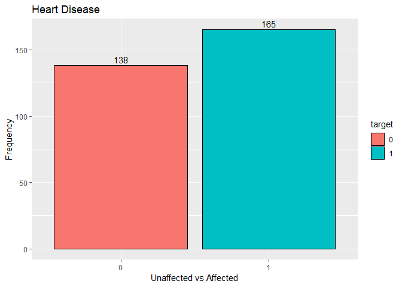
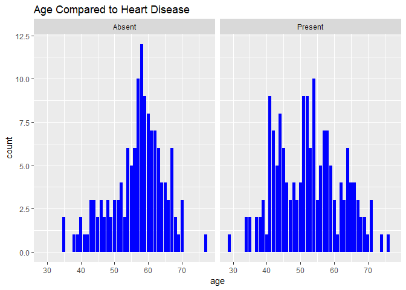
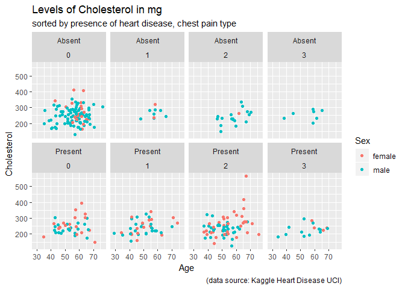
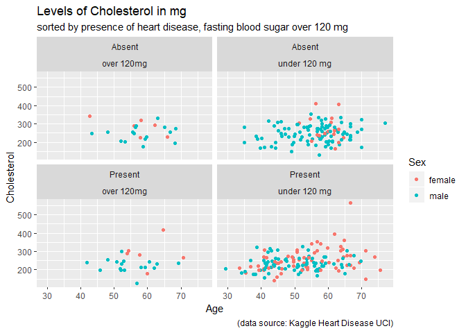
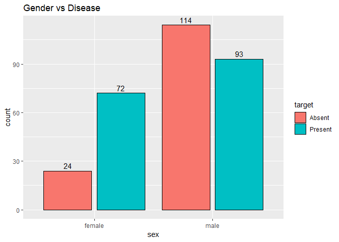
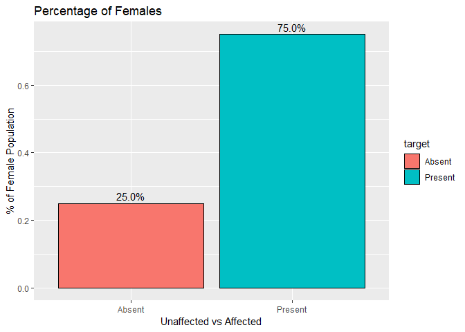
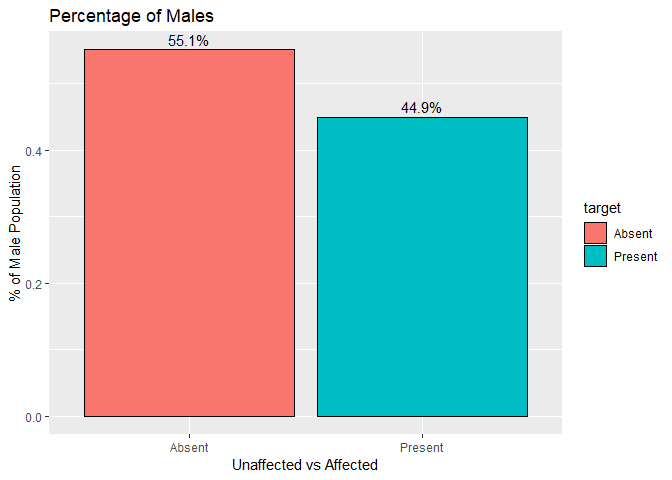
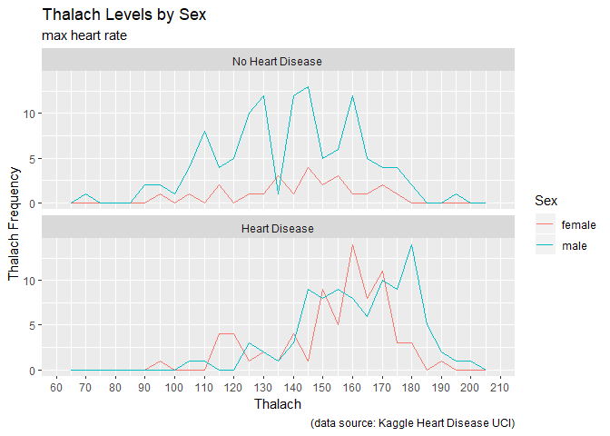
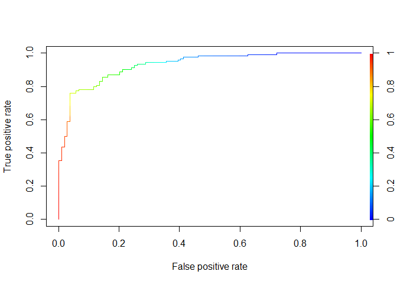

R Markdown
----------

``` r
library(tidyverse)
```

    ## -- Attaching packages ----------------------------------------------------------------------------------------- tidyverse 1.2.1 --

    ## v ggplot2 3.1.0     v purrr   0.3.0
    ## v tibble  2.0.1     v dplyr   0.7.8
    ## v tidyr   0.8.2     v stringr 1.3.1
    ## v readr   1.3.1     v forcats 0.3.0

    ## -- Conflicts -------------------------------------------------------------------------------------------- tidyverse_conflicts() --
    ## x dplyr::filter() masks stats::filter()
    ## x dplyr::lag()    masks stats::lag()

``` r
library(scales)
```

    ## 
    ## Attaching package: 'scales'

    ## The following object is masked from 'package:purrr':
    ## 
    ##     discard

    ## The following object is masked from 'package:readr':
    ## 
    ##     col_factor

``` r
library(dplyr)
library(corrplot)
```

    ## corrplot 0.84 loaded

``` r
library(ROCR)
```

    ## Loading required package: gplots

    ## 
    ## Attaching package: 'gplots'

    ## The following object is masked from 'package:stats':
    ## 
    ##     lowess

``` r
library(caTools)
library(rpart)
library(naivebayes)


heart<-read.csv("E:/Documents/R/Data/projects/data/heart.csv",
                  header = TRUE,
                  na.strings = "",
                  stringsAsFactors = FALSE
)
```

``` r
dim(heart) 
```

    ## [1] 303  14

``` r
na_count <- sort(sapply(heart, function(x) sum(is.na(x))),
                 decreasing = TRUE)
na_count
```

    ##   ï..age      sex       cp trestbps     chol      fbs  restecg  thalach 
    ##        0        0        0        0        0        0        0        0 
    ##    exang  oldpeak    slope       ca     thal   target 
    ##        0        0        0        0        0        0

``` r
glimpse(heart)
```

    ## Observations: 303
    ## Variables: 14
    ## $ ï..age   <int> 63, 37, 41, 56, 57, 57, 56, 44, 52, 57, 54, 48, 49, 6...
    ## $ sex      <int> 1, 1, 0, 1, 0, 1, 0, 1, 1, 1, 1, 0, 1, 1, 0, 0, 0, 0,...
    ## $ cp       <int> 3, 2, 1, 1, 0, 0, 1, 1, 2, 2, 0, 2, 1, 3, 3, 2, 2, 3,...
    ## $ trestbps <int> 145, 130, 130, 120, 120, 140, 140, 120, 172, 150, 140...
    ## $ chol     <int> 233, 250, 204, 236, 354, 192, 294, 263, 199, 168, 239...
    ## $ fbs      <int> 1, 0, 0, 0, 0, 0, 0, 0, 1, 0, 0, 0, 0, 0, 1, 0, 0, 0,...
    ## $ restecg  <int> 0, 1, 0, 1, 1, 1, 0, 1, 1, 1, 1, 1, 1, 0, 0, 1, 1, 1,...
    ## $ thalach  <int> 150, 187, 172, 178, 163, 148, 153, 173, 162, 174, 160...
    ## $ exang    <int> 0, 0, 0, 0, 1, 0, 0, 0, 0, 0, 0, 0, 0, 1, 0, 0, 0, 0,...
    ## $ oldpeak  <dbl> 2.3, 3.5, 1.4, 0.8, 0.6, 0.4, 1.3, 0.0, 0.5, 1.6, 1.2...
    ## $ slope    <int> 0, 0, 2, 2, 2, 1, 1, 2, 2, 2, 2, 2, 2, 1, 2, 1, 2, 0,...
    ## $ ca       <int> 0, 0, 0, 0, 0, 0, 0, 0, 0, 0, 0, 0, 0, 0, 0, 0, 0, 0,...
    ## $ thal     <int> 1, 2, 2, 2, 2, 1, 2, 3, 3, 2, 2, 2, 2, 2, 2, 2, 2, 2,...
    ## $ target   <int> 1, 1, 1, 1, 1, 1, 1, 1, 1, 1, 1, 1, 1, 1, 1, 1, 1, 1,...

``` r
colnames(heart)
```

    ##  [1] "ï..age"   "sex"      "cp"       "trestbps" "chol"     "fbs"     
    ##  [7] "restecg"  "thalach"  "exang"    "oldpeak"  "slope"    "ca"      
    ## [13] "thal"     "target"

age, sex, cp (chest pain type), tresbps (resting blood pressure), chol, fbs (fasting blood sugar &gt; 120 mg/dl, 1= true; 0 = false), restecg (resting ecg), thalach (max heart rate), exang (exercise induced), oldpeak, slope, ca (\# of major vessels colored by flourosopy), thal (3 = normal, 6 = fixed defect, 7 = reversible defect), target

lets look at the correlation between the features

``` r
cor_heart = cor(heart)
corrplot(cor_heart, method = "ellipse", type="upper")
```


thanks to this correlation plot, we can see that features trestbps,
chol, fbs, and restecg are the least correlated features. but just for completion's sake, we will use cholesterol as a metric in graphs to verify.

data cleaning
=============

``` r
heart$sex <- as.factor(heart$sex)
heart$sex <- ifelse(heart$sex == "0", "female", "male")
heart$cp <-as.factor(heart$cp)
heart$target <- as.factor(heart$target)
heart$restecg <- as.factor(heart$restecg)
heart$slope <- as.factor(heart$slope)
heart$exang <- as.factor(heart$exang)


colnames(heart)[1] <- "age"
colnames(heart)[3] <- "chest_pain"
colnames(heart)[6] <- "fasting_blood_sugar"
heart$fasting_blood_sugar <- ifelse(heart$fasting_blood_sugar == "0", "under 120 mg", "over 120mg")
heart$fasting_blood_sugar <- as.factor(heart$fasting_blood_sugar)

summary(heart)
```

    ##       age            sex            chest_pain    trestbps    
    ##  Min.   :29.00   Length:303         0:143      Min.   : 94.0  
    ##  1st Qu.:47.50   Class :character   1: 50      1st Qu.:120.0  
    ##  Median :55.00   Mode  :character   2: 87      Median :130.0  
    ##  Mean   :54.37                      3: 23      Mean   :131.6  
    ##  3rd Qu.:61.00                                 3rd Qu.:140.0  
    ##  Max.   :77.00                                 Max.   :200.0  
    ##       chol         fasting_blood_sugar restecg    thalach      exang  
    ##  Min.   :126.0   over 120mg  : 45      0:147   Min.   : 71.0   0:204  
    ##  1st Qu.:211.0   under 120 mg:258      1:152   1st Qu.:133.5   1: 99  
    ##  Median :240.0                         2:  4   Median :153.0          
    ##  Mean   :246.3                                 Mean   :149.6          
    ##  3rd Qu.:274.5                                 3rd Qu.:166.0          
    ##  Max.   :564.0                                 Max.   :202.0          
    ##     oldpeak     slope         ca              thal       target 
    ##  Min.   :0.00   0: 21   Min.   :0.0000   Min.   :0.000   0:138  
    ##  1st Qu.:0.00   1:140   1st Qu.:0.0000   1st Qu.:2.000   1:165  
    ##  Median :0.80   2:142   Median :0.0000   Median :2.000          
    ##  Mean   :1.04           Mean   :0.7294   Mean   :2.314          
    ##  3rd Qu.:1.60           3rd Qu.:1.0000   3rd Qu.:3.000          
    ##  Max.   :6.20           Max.   :4.0000   Max.   :3.000

``` r
glimpse(heart)
```

    ## Observations: 303
    ## Variables: 14
    ## $ age                 <int> 63, 37, 41, 56, 57, 57, 56, 44, 52, 57, 54...
    ## $ sex                 <chr> "male", "male", "female", "male", "female"...
    ## $ chest_pain          <fct> 3, 2, 1, 1, 0, 0, 1, 1, 2, 2, 0, 2, 1, 3, ...
    ## $ trestbps            <int> 145, 130, 130, 120, 120, 140, 140, 120, 17...
    ## $ chol                <int> 233, 250, 204, 236, 354, 192, 294, 263, 19...
    ## $ fasting_blood_sugar <fct> over 120mg, under 120 mg, under 120 mg, un...
    ## $ restecg             <fct> 0, 1, 0, 1, 1, 1, 0, 1, 1, 1, 1, 1, 1, 0, ...
    ## $ thalach             <int> 150, 187, 172, 178, 163, 148, 153, 173, 16...
    ## $ exang               <fct> 0, 0, 0, 0, 1, 0, 0, 0, 0, 0, 0, 0, 0, 1, ...
    ## $ oldpeak             <dbl> 2.3, 3.5, 1.4, 0.8, 0.6, 0.4, 1.3, 0.0, 0....
    ## $ slope               <fct> 0, 0, 2, 2, 2, 1, 1, 2, 2, 2, 2, 2, 2, 1, ...
    ## $ ca                  <int> 0, 0, 0, 0, 0, 0, 0, 0, 0, 0, 0, 0, 0, 0, ...
    ## $ thal                <int> 1, 2, 2, 2, 2, 1, 2, 3, 3, 2, 2, 2, 2, 2, ...
    ## $ target              <fct> 1, 1, 1, 1, 1, 1, 1, 1, 1, 1, 1, 1, 1, 1, ...

Target
------

First identify what the target feature looks like by itself

``` r
rate_affected <- ggplot(heart, aes(x = target, fill = target)) +
  geom_bar(position = "dodge2", color = "black") +
  geom_text(stat = 'count', aes(label = ..count.., vjust=-0.4), position = position_dodge(width=0.9)) +
  ggtitle("Heart Disease")

rate_affected + labs(x = "Unaffected vs Affected",
                     y = "Frequency"
                     )
```



change the target variable from 0~1 to have heart disease or absent

``` r
heart$target <- ifelse(heart$target == "1", "Present", "Absent")
heart$target <- as.factor(heart$target)
```

age
---

``` r
ggplot(data = heart) +
  geom_bar(aes(x=age), fill = "blue") +
  facet_wrap(~ target) +
  ggtitle("Age Compared to Heart Disease")
```



looking at affected and unaffected rates in measures of cholesterol
-------------------------------------------------------------------

### sorted by chest pain type

``` r
age_chol2 <- ggplot(data = heart) +
  geom_point(mapping = aes(x = heart$age, y = heart$chol, color = heart$sex), position = "jitter") +
  facet_wrap(heart$target ~ heart$chest_pain, nrow = 4, ncol = 4)

age_chol2 + labs(x = "Age", 
                 y = " Cholesterol", 
                 color = "Sex", 
                 title = "Levels of Cholesterol in mg", 
                 subtitle = "sorted by presence of heart disease, chest pain type", 
                 caption = "(data source: Kaggle Heart Disease UCI)"
                 )
```



### sorted by rest ecg

``` r
age_chol3 <- ggplot(data = heart) +
  geom_point(mapping = aes(x = heart$age, y = heart$chol, color = heart$sex), position = "jitter") +
  facet_wrap(heart$target ~ heart$restecg, ncol = 3, nrow = 2)

age_chol3 + labs(x = "Age", 
                 y = " Cholesterol", 
                 color = "Sex", 
                 title = "Levels of Cholesterol in mg", 
                 subtitle = "sorted by presence of heart disease, restecg", 
                 caption = "(data source: Kaggle Heart Disease UCI)"
                 )
```


### sorted by fasting blood sugar over 120 mg

``` r
age_chol4 <- ggplot(data = heart) +
  geom_point(mapping = aes(x = heart$age, y = heart$chol, color = heart$sex), position = "jitter") +
  facet_wrap(heart$target ~ heart$fasting_blood_sugar, ncol = 2, nrow = 2)

age_chol4 + labs(x = "Age", 
                 y = " Cholesterol", 
                 color = "Sex", 
                 title = "Levels of Cholesterol in mg", 
                 subtitle = "sorted by presence of heart disease, fasting blood sugar over 120 mg", 
                 caption = "(data source: Kaggle Heart Disease UCI)"
)
```

 \#\# Sex

``` r
ggplot(heart, aes(x = sex, fill = target)) +
  geom_bar(position = "dodge2", color = "black") +
  geom_text(stat = 'count', aes(label = ..count.., vjust=-0.4), position = position_dodge(width=0.9)) +
  ggtitle("Gender vs Disease") 
```



``` r
male_hearts <- filter(heart, sex == "male")
female_hearts <- filter(heart, sex== "female")

ggplot(female_hearts, aes(x = target)) +
  geom_bar(aes(y = (..count..)/sum(..count..), fill = target), stat = "count", color = "black") +
  geom_text(aes( label = scales::percent((..count..)/sum(..count..)),
                 y= ((..count..)/sum(..count..))), stat= "count", vjust = -0.4) +
  ggtitle("Percentage of Females") +
  xlab("Unaffected vs Affected") +
  ylab("% of Female Population")
```



``` r
ggplot(male_hearts, aes(x = target)) +
  geom_bar(aes(y = (..count..)/sum(..count..), fill = target), stat = "count", color = "black") +
  geom_text(aes( label = scales::percent((..count..)/sum(..count..)),
                 y= ((..count..)/sum(..count..))), stat= "count", vjust = -0.4) +
  ggtitle("Percentage of Males") +
  xlab("Unaffected vs Affected") +
  ylab("% of Male Population")
```



``` r
heart_disease_category <- c('Absent' = 'No Heart Disease',
                            'Present' = 'Heart Disease')

thalsex <- qplot(x = thalach, data = heart, binwidth = 5, geom = 'freqpoly', color = sex) +
  scale_x_continuous(breaks = seq(0, 303, 10)) +
  facet_wrap(heart$target, nrow = 2, labeller = as_labeller(heart_disease_category))


thalsex + labs(x = "Thalach",
               y = "Thalach Frequency",
               color = "Sex",
               title = "Thalach Levels by Sex",
               subtitle = "max heart rate",
               caption ="(data source: Kaggle Heart Disease UCI)"
                )
```



Features more likely to affect presence of heart disease so far: chest pain, age, sex, exang, old peak, ca, slope, thal, thalach

Creating a model
================

``` r
set.seed(999)
splitter = sample.split(heart$target, SplitRatio = 0.75)
train = subset(heart, splitter == TRUE)
test = subset(heart, splitter == FALSE)


glm_mod <- glm(target ~ sex + chest_pain + thalach + thal + ca + slope + exang + oldpeak, data=train, family = "binomial")
pred <- predict(glm_mod, newdata = train, type = "response")


summary(glm_mod)
```

    ## 
    ## Call:
    ## glm(formula = target ~ sex + chest_pain + thalach + thal + ca + 
    ##     slope + exang + oldpeak, family = "binomial", data = train)
    ## 
    ## Deviance Residuals: 
    ##     Min       1Q   Median       3Q      Max  
    ## -2.4880  -0.4356   0.1672   0.4481   2.6789  
    ## 
    ## Coefficients:
    ##             Estimate Std. Error z value Pr(>|z|)    
    ## (Intercept)  0.04890    2.09522   0.023  0.98138    
    ## sexmale     -1.63596    0.53856  -3.038  0.00238 ** 
    ## chest_pain1  2.09106    0.77260   2.707  0.00680 ** 
    ## chest_pain2  2.23851    0.51580   4.340 1.43e-05 ***
    ## chest_pain3  1.74566    0.71526   2.441  0.01466 *  
    ## thalach      0.01889    0.01087   1.738  0.08221 .  
    ## thal        -0.75886    0.31465  -2.412  0.01588 *  
    ## ca          -0.61345    0.20338  -3.016  0.00256 ** 
    ## slope1       0.06429    0.95577   0.067  0.94637    
    ## slope2       1.04426    0.99419   1.050  0.29355    
    ## exang1      -1.02616    0.47423  -2.164  0.03048 *  
    ## oldpeak     -0.52159    0.23722  -2.199  0.02790 *  
    ## ---
    ## Signif. codes:  0 '***' 0.001 '**' 0.01 '*' 0.05 '.' 0.1 ' ' 1
    ## 
    ## (Dispersion parameter for binomial family taken to be 1)
    ## 
    ##     Null deviance: 314.32  on 227  degrees of freedom
    ## Residual deviance: 154.02  on 216  degrees of freedom
    ## AIC: 178.02
    ## 
    ## Number of Fisher Scoring iterations: 6

``` r
ROCRpred <- prediction(pred, train$target)
plot(performance(ROCRpred,"tpr","fpr"), colorize=TRUE)
```


